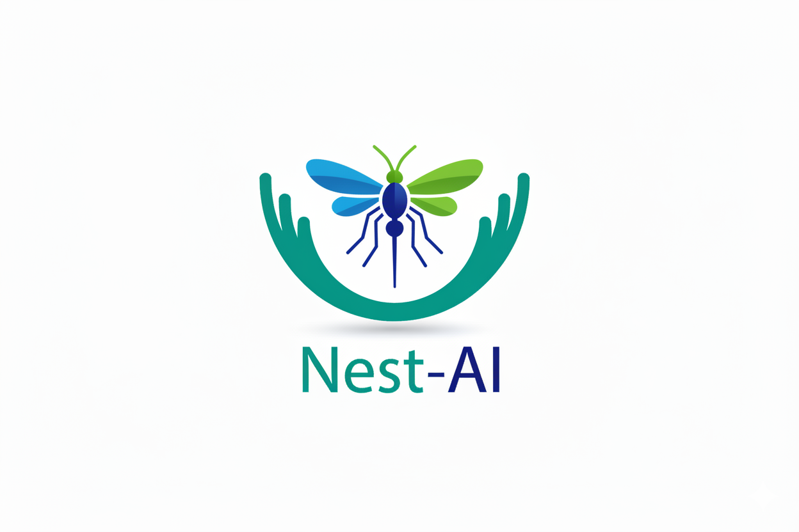
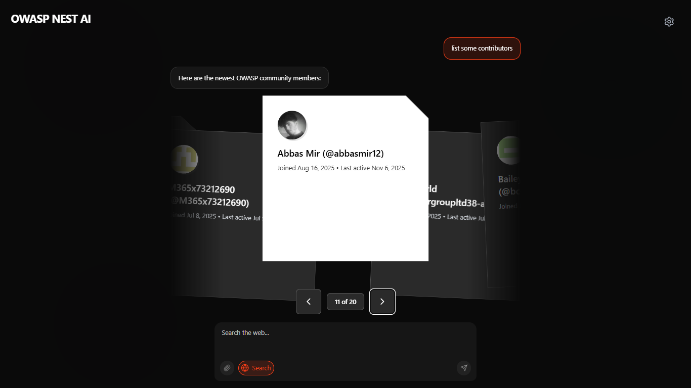

# Nest AI

Nest AI transforms how developers and security professionals interact with OWASP resources by providing a natural language interface powered by **real-time data from the OWASP Nest API**. Users can discover projects, events, issues, contributors, and chapters by simply asking questions in plain English and receiving intelligent, contextual responses with interactive visual cards.


## The Problem

The OWASP ecosystem is vast and rich with resources, but discovering relevant projects, finding contribution opportunities, or locating local chapters can be challenging for newcomers and experienced developers alike. Traditional API interactions require understanding endpoints, parameters, and data structures, creating a barrier to entry.

## The Solution

Nest AI bridges this gap by combining three powerful technologies:

- **AI-Powered Intent Detection**: Uses HuggingFace's language models to understand user queries in natural language
- **Model Context Protocol (MCP)**: A middleware layer that abstracts OWASP Nest API interactions into semantic tools
- **Interactive UI**: Modern, animated interface that presents data as visually appealing, actionable cards

## Live Data Integration

**Nest AI now uses real-time data from the OWASP Nest API!** 


Thanks to the Model Context Protocol (MCP) integration, all queries fetch live data directly from OWASP's official API. This means:

- **Real Projects**: Discover actual OWASP projects with current status, leaders, and links
- **Live Events**: Get up-to-date information on upcoming conferences, meetups, and workshops
- **Active Issues**: Find real contribution opportunities from OWASP GitHub repositories
- **Current Contributors**: See who's actively contributing to OWASP projects right now
- **Active Chapters**: Connect with real local OWASP chapters in your area

The MCP server handles all API authentication and data fetching, providing a seamless experience where users simply ask questions and receive accurate, current information from the OWASP ecosystem.

## How It Works

### Architecture

```
User Query → AI Provider (HuggingFace) → MCP Server → OWASP Nest API
                                               ↓
                                     Structured Response
                                               ↓
                                     Interactive Cards UI
```

### Workflow

1. **User Input**: User asks a question like "I'm a Python developer looking for security projects to contribute to"

2. **AI Processing**: The query is sent to HuggingFace's Llama model with a specialized system prompt that understands OWASP context

3. **MCP Tool Selection**: The AI determines which MCP tools to call based on intent:
   - `nest_get_projects` - For project discovery
   - `nest_get_events` - For upcoming events
   - `nest_get_issues` - For contribution opportunities
   - `nest_get_contributors` - For finding active contributors
   - `nest_get_chapters` - For local community chapters

4. **Data Fetching**: MCP server calls the OWASP Nest API with appropriate parameters

5. **Response Generation**: AI synthesizes the data into a conversational summary

6. **Visual Presentation**: Results are displayed as animated, interactive cards with direct links to resources

## Real-World Use Cases

### Example 1: New Contributor

**User**: "I'm a Python programmer and want to contribute to security tools. What projects should I look at?"

**Nest AI Response**:
- Detects intent: project discovery + contribution opportunities
- Calls `nest_get_projects` with filters for tool-type projects
- Calls `nest_get_issues` to find beginner-friendly issues
- Returns conversational summary with project cards showing:
  - Project name and description
  - Technology stack
  - Open issues suitable for Python developers
  - Direct links to repositories

### Example 2: Event Discovery

**User**: "Are there any OWASP events happening near San Francisco in the next 3 months?"

**Nest AI Response**:
- Detects intent: event search with location filter
- Calls `nest_get_events` with location and date parameters
- Returns event cards showing:
  - Event name and description
  - Date and location
  - Registration links
  - Related chapters

### Example 3: Community Connection

**User**: "I want to join my local OWASP chapter. I'm in London."

**Nest AI Response**:
- Detects intent: chapter discovery
- Calls `nest_get_chapters` with location filter
- Returns chapter cards with:
  - Chapter name and meeting frequency
  - Contact information
  - Upcoming meetups
  - Links to join

### Example 4: Finding High-Priority Issues

**User**: "Show me high-priority security issues I can help fix"

**Nest AI Response**:
- Detects intent: contribution opportunities with priority filter
- Calls `nest_get_issues` with `priority=high` parameter
- Returns issue cards displaying:
  - Issue title and description
  - Project name
  - Priority level and labels
  - Direct links to GitHub issues
  - Estimated difficulty level

## Key Features

### 1. Natural Language Understanding
- No need to learn API syntax or endpoints
- Conversational interface that understands context
- Handles complex, multi-part queries

### 2. Intelligent Data Fetching
- Automatically determines which data sources to query
- Combines multiple API calls when needed
- Filters and prioritizes results based on user intent

### 3. Interactive Visual Cards
- Animated card displays using Framer Motion
- Staggered entrance animations for visual appeal
- Direct action links (visit project, register for event, view issue)
- Responsive design for all screen sizes

### 4. Flexible AI Configuration
- User-provided HuggingFace API keys (no server-side key storage)
- Configurable model selection
- Privacy-focused: API keys never leave the client

### 5. Model Context Protocol Integration
- Five specialized MCP tools for OWASP data
- Standardized tool interface following MCP specification
- Extensible architecture for adding new data sources

## Technology Stack

### Frontend
- **Next.js 14** (App Router) - React framework with server-side rendering
- **TypeScript** - Type-safe development
- **Tailwind CSS** - Utility-first styling
- **Framer Motion** - Smooth animations and transitions
- **Lucide React** - Icon library

### Backend
- **Next.js API Routes** - Serverless API endpoints
- **HuggingFace Inference API** - AI language model provider
- **Axios** - HTTP client for API requests

### MCP Server
- **Node.js** - Runtime environment
- **@modelcontextprotocol/sdk** - Official MCP implementation
- **Express** - HTTP server framework
- **Zod** - Schema validation

## Getting Started

### Prerequisites

- Node.js 18 or higher
- npm or yarn package manager
- HuggingFace account and API key (free tier available)

### Installation

1. Clone the repository:
```bash
git clone https://github.com/abbasmir12/nest-ai.git
cd nest-ai
```

2. Install dependencies:
```bash
npm install
```

3. Install MCP server dependencies:
```bash
cd mcp-server
npm install
cd ..
```

4. Create environment file (optional):
```bash
cp .env.local.example .env.local
```

### Running the Application

1. Start the Next.js development server:
```bash
npm run dev
```

2. In a separate terminal, start the MCP server:
```bash
npm run mcp
```

3. Open your browser to `http://localhost:3000`

4. Click the settings icon (top-right) and enter your HuggingFace API key

5. Start asking questions about OWASP resources!

### Getting a HuggingFace API Key

1. Visit https://huggingface.co/
2. Create a free account
3. Go to Settings → Access Tokens
4. Create a new token with read permissions
5. Copy the token and paste it in Nest AI settings

## Project Structure

```
nest-ai/
├── src/
│   ├── app/
│   │   ├── api/chat/          # Chat API endpoint
│   │   ├── layout.tsx         # Root layout
│   │   ├── page.tsx           # Home page
│   │   └── globals.css        # Global styles
│   ├── components/
│   │   ├── ui/                # Reusable UI components
│   │   ├── ChatInterface.tsx  # Main chat interface
│   │   ├── DisplayCard.tsx    # Individual card component
│   │   └── AiInput.tsx        # Auto-resizing input
│   ├── lib/
│   │   ├── ai-provider.ts     # HuggingFace integration
│   │   ├── mcp-client.ts      # MCP client abstraction
│   │   ├── response-protocol.ts # Response parsing
│   │   └── utils.ts           # Helper functions
│   └── types/
│       └── index.ts           # TypeScript definitions
├── mcp-server/
│   ├── stdio-server.js        # MCP server implementation
│   ├── http-server.js         # HTTP wrapper for MCP
│   └── package.json           # MCP dependencies
└── scripts/
    ├── setup.sh               # Unix setup script
    └── setup.ps1              # Windows setup script
```

## MCP Tools Reference

### nest_get_projects
Fetches OWASP projects with optional filters.

**Parameters**:
- `level`: Project maturity (flagship, lab, incubator)
- `type`: Project type (tool, documentation, code)
- `limit`: Maximum results (default: 10)

**Returns**: Array of project objects with name, description, URL, level, type, and leaders

### nest_get_events
Fetches upcoming OWASP events and conferences.

**Parameters**:
- `limit`: Maximum results (default: 10)
- `upcoming`: Filter for future events (default: true)

**Returns**: Array of event objects with name, description, date, location, and URL

### nest_get_issues
Fetches open issues from OWASP projects.

**Parameters**:
- `priority`: Issue priority (high, medium, low)
- `project`: Filter by specific project
- `limit`: Maximum results (default: 10)

**Returns**: Array of issue objects with title, project, priority, labels, URL, and creation date

### nest_get_contributors
Fetches top contributors to OWASP projects.

**Parameters**:
- `limit`: Maximum results (default: 10)
- `project`: Filter by specific project

**Returns**: Array of contributor objects with name, contribution count, projects, and profile URL

### nest_get_chapters
Fetches OWASP chapters worldwide.

**Parameters**:
- `location`: Filter by region or city
- `limit`: Maximum results (default: 10)

**Returns**: Array of chapter objects with name, location, meeting frequency, and URL

## How the AI Integration Works

### User-Provided API Keys

Nest AI uses a privacy-first approach where users provide their own HuggingFace API keys through the settings interface. This means:

- No API keys are stored on the server
- Keys are kept in browser memory only during the session
- Each user controls their own AI usage and costs
- Free tier HuggingFace accounts work perfectly for typical usage

### AI Model Configuration

The default model is `meta-llama/Llama-3.1-8B-Instruct`, chosen for:

- Strong natural language understanding
- Good performance on intent detection
- Ability to follow structured output formats
- Free availability through HuggingFace Inference API

Users can configure alternative models through the settings panel if desired.

### System Prompt Engineering

The AI is guided by a carefully crafted system prompt that:

- Defines its role as an OWASP assistant
- Lists available MCP tools and their purposes
- Specifies the structured response format
- Provides examples of proper tool usage
- Ensures responses are concise and actionable

### Response Protocol

Nest AI uses a structured response protocol where the AI returns JSON containing:

- `summary`: Natural language explanation for the user
- `cards`: Array of structured data objects for visual display

This ensures consistent, parseable responses that can be reliably rendered as interactive cards.

## Development

### Running Tests
```bash
npm run lint
```

### Building for Production
```bash
npm run build
npm run start
```

### Environment Variables

Create a `.env.local` file with:

```bash
# Optional: Default MCP server URL
MCP_SERVER_URL=http://localhost:3001/mcp
```

**Note**: HuggingFace API keys are provided by users through the UI and never stored server-side. The OWASP Nest API is accessed through the MCP server, which handles all authentication automatically.

## Future Enhancements & Roadmap

We're continuously improving Nest AI with many exciting features planned:

### Near-Term Improvements
- **Conversation History**: Persist chat sessions across page reloads with local storage
- **Advanced Filters**: More granular search and filtering options for precise results
- **Bookmarking System**: Save favorite projects, events, or issues for quick access
- **Enhanced Error Handling**: Better feedback when API calls fail or timeout
- **Response Caching**: Cache frequent queries to improve performance
- **Improved Card Interactions**: More interactive elements and hover states

### Mid-Term Features
- **Notifications**: Alert users about new events or issues matching their interests
- **Multi-language Support**: Internationalization for the global OWASP community
- **Voice Input**: Speech-to-text for hands-free queries
- **Export Features**: Download results as PDF, CSV, or JSON
- **Dark Mode**: Full dark theme support with user preference persistence
- **Search History**: Quick access to previous queries and results

### Long-Term Vision
- **Collaborative Features**: Share queries and results with team members
- **Analytics Dashboard**: Track contribution opportunities and community engagement metrics
- **Smart Recommendations**: AI-powered suggestions based on user interests and history
- **Integration Hub**: Connect with GitHub, Slack, and other developer tools
- **Mobile App**: Native iOS and Android applications
- **Advanced AI Models**: Support for multiple AI providers and custom fine-tuned models
- **Personalized Feed**: Curated OWASP content based on user preferences
- **Community Features**: Direct messaging, forums, and collaboration tools

We're committed to making Nest AI the go-to interface for the OWASP community. Contributions and feature requests are always welcome!

## Contributing

We welcome contributions from the community! Whether it's:

- Bug reports and fixes
- Feature requests and implementations
- Documentation improvements
- UI/UX enhancements
- Performance optimizations

Please check out our [CONTRIBUTING.md](CONTRIBUTING.md) for guidelines.

## License

This project is licensed under the MIT License - see the [LICENSE](LICENSE) file for details.

